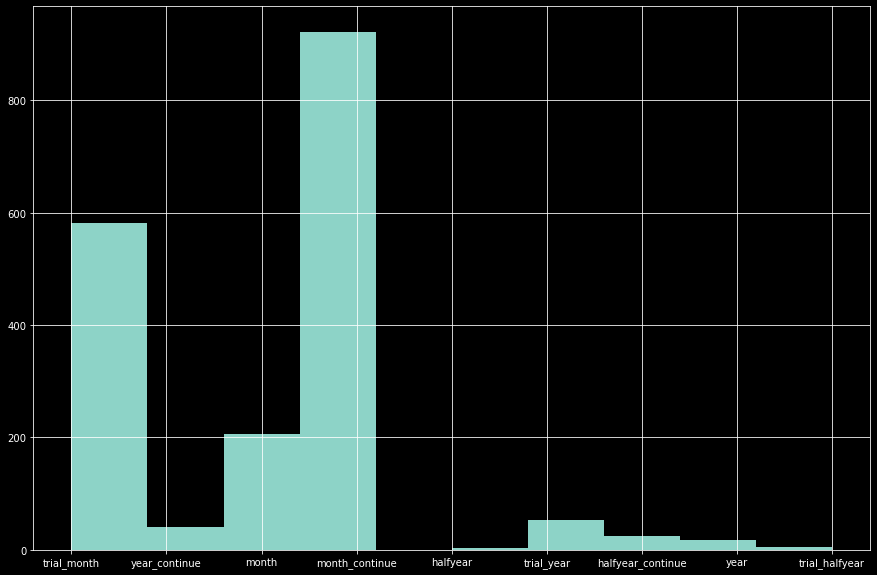
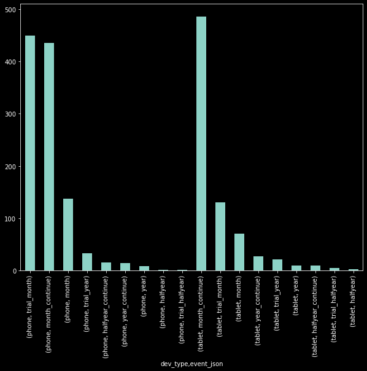
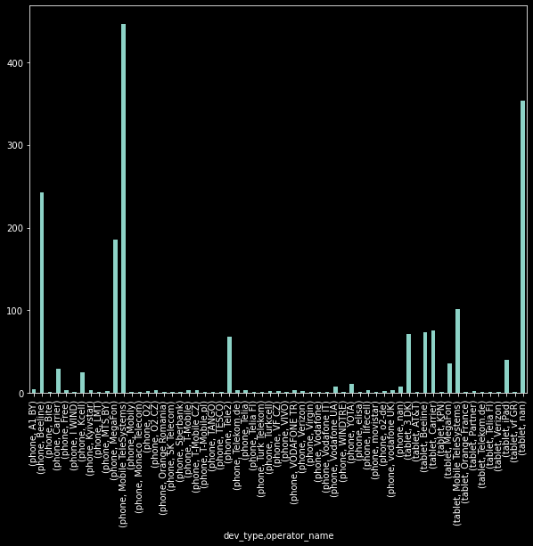

```python
import pandas as pd
```


```python
data = pd.read_csv('events.csv')
data
```


<div>
<style scoped>
    .dataframe tbody tr th:only-of-type {
        vertical-align: middle;
    }

    .dataframe tbody tr th {
        vertical-align: top;
    }

    .dataframe thead th {
        text-align: right;
    }
</style>
<table border="1" class="dataframe">
  <thead>
    <tr style="text-align: right;">
      <th></th>
      <th>device_model</th>
      <th>os_name</th>
      <th>os_version</th>
      <th>device_locale</th>
      <th>event_name</th>
      <th>event_json</th>
      <th>event_timestamp</th>
      <th>operator_name</th>
      <th>city</th>
      <th>appmetrica_device_id</th>
      <th>session_id</th>
    </tr>
  </thead>
  <tbody>
    <tr>
      <th>0</th>
      <td>iPad11,4</td>
      <td>ios</td>
      <td>15.4.1</td>
      <td>ru_RU</td>
      <td>promo</td>
      <td>{"open":"448"}</td>
      <td>1657289445</td>
      <td>Carrier</td>
      <td>NaN</td>
      <td>15051736875289922241</td>
      <td>10000000488</td>
    </tr>
    <tr>
      <th>1</th>
      <td>iPhone X</td>
      <td>ios</td>
      <td>15.5</td>
      <td>ru_RU</td>
      <td>collections</td>
      <td>{"click_from_main":"reсommended"}</td>
      <td>1657359967</td>
      <td>Tele2</td>
      <td>NaN</td>
      <td>10795071844267303686</td>
      <td>10000000003</td>
    </tr>
    <tr>
      <th>2</th>
      <td>iPhone X</td>
      <td>ios</td>
      <td>15.5</td>
      <td>ru_RU</td>
      <td>collections</td>
      <td>{"click_from_main":"reсommended"}</td>
      <td>1657359983</td>
      <td>Tele2</td>
      <td>NaN</td>
      <td>10795071844267303686</td>
      <td>10000000003</td>
    </tr>
    <tr>
      <th>3</th>
      <td>iPhone X</td>
      <td>ios</td>
      <td>15.5</td>
      <td>ru_RU</td>
      <td>collections</td>
      <td>{"click_from_main":"reсommended"}</td>
      <td>1657359984</td>
      <td>Tele2</td>
      <td>NaN</td>
      <td>10795071844267303686</td>
      <td>10000000003</td>
    </tr>
    <tr>
      <th>4</th>
      <td>iPhone X</td>
      <td>ios</td>
      <td>15.5</td>
      <td>ru_RU</td>
      <td>collections</td>
      <td>{"click_from_main":"reсommended"}</td>
      <td>1657359984</td>
      <td>Tele2</td>
      <td>NaN</td>
      <td>10795071844267303686</td>
      <td>10000000003</td>
    </tr>
    <tr>
      <th>...</th>
      <td>...</td>
      <td>...</td>
      <td>...</td>
      <td>...</td>
      <td>...</td>
      <td>...</td>
      <td>...</td>
      <td>...</td>
      <td>...</td>
      <td>...</td>
      <td>...</td>
    </tr>
    <tr>
      <th>1464102</th>
      <td>iPhone X</td>
      <td>ios</td>
      <td>14.6</td>
      <td>ru_RU</td>
      <td>Синий трактор</td>
      <td>{"paid":"start"}</td>
      <td>1657091407</td>
      <td>Mobile TeleSystems</td>
      <td>NaN</td>
      <td>3569081596068158176</td>
      <td>10000000019</td>
    </tr>
    <tr>
      <th>1464103</th>
      <td>iPhone X</td>
      <td>ios</td>
      <td>14.6</td>
      <td>ru_RU</td>
      <td>Синий трактор</td>
      <td>{"paid":"2"}</td>
      <td>1657092048</td>
      <td>Mobile TeleSystems</td>
      <td>NaN</td>
      <td>3569081596068158176</td>
      <td>10000000020</td>
    </tr>
    <tr>
      <th>1464104</th>
      <td>iPhone X</td>
      <td>ios</td>
      <td>14.6</td>
      <td>ru_RU</td>
      <td>Синий трактор</td>
      <td>{"paid":"start"}</td>
      <td>1657092048</td>
      <td>Mobile TeleSystems</td>
      <td>NaN</td>
      <td>3569081596068158176</td>
      <td>10000000020</td>
    </tr>
    <tr>
      <th>1464105</th>
      <td>iPhone XS</td>
      <td>ios</td>
      <td>15.4.1</td>
      <td>ru_TR</td>
      <td>Синий трактор</td>
      <td>{"paid":"1"}</td>
      <td>1657103636</td>
      <td>VODAFONE TR</td>
      <td>NaN</td>
      <td>7362504062805900511</td>
      <td>10000000020</td>
    </tr>
    <tr>
      <th>1464106</th>
      <td>iPhone XS</td>
      <td>ios</td>
      <td>15.4.1</td>
      <td>ru_TR</td>
      <td>Синий трактор</td>
      <td>{"paid":"start"}</td>
      <td>1657103636</td>
      <td>VODAFONE TR</td>
      <td>NaN</td>
      <td>7362504062805900511</td>
      <td>10000000020</td>
    </tr>
  </tbody>
</table>
<p>1464107 rows × 11 columns</p>
</div>


### Выборка по значению условию задания

> __Условие выборки:__ event_name  = purchase и первый ключ у event_json = subscription


```python
# выборка event_name = purchase
df_group = data.groupby('event_name').get_group('purchase').copy()

# выборка event_json = subscription
df_group = df_group.assign(copy_val = lambda x:(x['event_json']))
df_group['copy_val'] = (df_group['copy_val'].apply ( lambda x: x[2:14]))
df_group = df_group.groupby('copy_val').get_group('subsription"').copy()
df_group.reset_index(inplace = True, drop = True)
df_group
```


<div>
<style scoped>
    .dataframe tbody tr th:only-of-type {
        vertical-align: middle;
    }

    .dataframe tbody tr th {
        vertical-align: top;
    }

    .dataframe thead th {
        text-align: right;
    }
</style>
<table border="1" class="dataframe">
  <thead>
    <tr style="text-align: right;">
      <th></th>
      <th>device_model</th>
      <th>os_name</th>
      <th>os_version</th>
      <th>device_locale</th>
      <th>event_name</th>
      <th>event_json</th>
      <th>event_timestamp</th>
      <th>operator_name</th>
      <th>city</th>
      <th>appmetrica_device_id</th>
      <th>session_id</th>
      <th>copy_val</th>
    </tr>
  </thead>
  <tbody>
    <tr>
      <th>0</th>
      <td>iPhone 11</td>
      <td>ios</td>
      <td>15.5</td>
      <td>ru_RU</td>
      <td>purchase</td>
      <td>{"subsription":"trial_month"}</td>
      <td>1656847021</td>
      <td>Mobile TeleSystems</td>
      <td>NaN</td>
      <td>6580173042331039912</td>
      <td>10000000003</td>
      <td>subsription"</td>
    </tr>
    <tr>
      <th>1</th>
      <td>iPhone 11 Pro Max</td>
      <td>ios</td>
      <td>15.3.1</td>
      <td>ru_RU</td>
      <td>purchase</td>
      <td>{"subsription":"year_continue"}</td>
      <td>1656665198</td>
      <td>MegaFon</td>
      <td>NaN</td>
      <td>17036039798299278349</td>
      <td>10000001494</td>
      <td>subsription"</td>
    </tr>
    <tr>
      <th>2</th>
      <td>iPad 7G</td>
      <td>ios</td>
      <td>15.3.1</td>
      <td>ru_RU</td>
      <td>purchase</td>
      <td>{"subsription":"trial_month"}</td>
      <td>1656723315</td>
      <td>NaN</td>
      <td>NaN</td>
      <td>11884726712749491185</td>
      <td>10000000003</td>
      <td>subsription"</td>
    </tr>
    <tr>
      <th>3</th>
      <td>iPad13,1</td>
      <td>ios</td>
      <td>15.5</td>
      <td>en_DE</td>
      <td>purchase</td>
      <td>{"subsription":"month"}</td>
      <td>1656919153</td>
      <td>NaN</td>
      <td>NaN</td>
      <td>15790577441923540820</td>
      <td>10000000069</td>
      <td>subsription"</td>
    </tr>
    <tr>
      <th>4</th>
      <td>iPhone 12</td>
      <td>ios</td>
      <td>15.5</td>
      <td>ru_RU</td>
      <td>purchase</td>
      <td>{"subsription":"trial_month"}</td>
      <td>1657038203</td>
      <td>YOTA</td>
      <td>NaN</td>
      <td>7195811132972355394</td>
      <td>10000000012</td>
      <td>subsription"</td>
    </tr>
    <tr>
      <th>...</th>
      <td>...</td>
      <td>...</td>
      <td>...</td>
      <td>...</td>
      <td>...</td>
      <td>...</td>
      <td>...</td>
      <td>...</td>
      <td>...</td>
      <td>...</td>
      <td>...</td>
      <td>...</td>
    </tr>
    <tr>
      <th>1851</th>
      <td>iPad Air</td>
      <td>ios</td>
      <td>12.5.5</td>
      <td>ru_RU</td>
      <td>purchase</td>
      <td>{"subsription":"month_continue"}</td>
      <td>1656846660</td>
      <td>Mobile TeleSystems</td>
      <td>NaN</td>
      <td>4746483851013094240</td>
      <td>10000001057</td>
      <td>subsription"</td>
    </tr>
    <tr>
      <th>1852</th>
      <td>iPhone 13</td>
      <td>ios</td>
      <td>15.4.1</td>
      <td>ru_RU</td>
      <td>purchase</td>
      <td>{"subsription":"trial_month"}</td>
      <td>1656764781</td>
      <td>Mobile TeleSystems</td>
      <td>NaN</td>
      <td>10804755131225170624</td>
      <td>10000000003</td>
      <td>subsription"</td>
    </tr>
    <tr>
      <th>1853</th>
      <td>iPad 7G</td>
      <td>ios</td>
      <td>14.8.1</td>
      <td>ru_RU</td>
      <td>purchase</td>
      <td>{"subsription":"month_continue"}</td>
      <td>1657021745</td>
      <td>NaN</td>
      <td>NaN</td>
      <td>3308406041175240981</td>
      <td>10000000007</td>
      <td>subsription"</td>
    </tr>
    <tr>
      <th>1854</th>
      <td>iPhone X</td>
      <td>ios</td>
      <td>14.6</td>
      <td>ru_RU</td>
      <td>purchase</td>
      <td>{"subsription":"trial_month"}</td>
      <td>1657049642</td>
      <td>Mobile TeleSystems</td>
      <td>NaN</td>
      <td>3569081596068158176</td>
      <td>10000000008</td>
      <td>subsription"</td>
    </tr>
    <tr>
      <th>1855</th>
      <td>iPhone XS</td>
      <td>ios</td>
      <td>15.4.1</td>
      <td>ru_TR</td>
      <td>purchase</td>
      <td>{"subsription":"trial_month"}</td>
      <td>1657045338</td>
      <td>VODAFONE TR</td>
      <td>NaN</td>
      <td>7362504062805900511</td>
      <td>10000000014</td>
      <td>subsription"</td>
    </tr>
  </tbody>
</table>
<p>1856 rows × 12 columns</p>
</div>


```python
#проверка пустых полей
df_group.isna().mean().sort_values(ascending=False)
```


    city                    0.975216
    operator_name           0.195043
    device_model            0.000000
    os_name                 0.000000
    os_version              0.000000
    device_locale           0.000000
    event_name              0.000000
    event_json              0.000000
    event_timestamp         0.000000
    appmetrica_device_id    0.000000
    session_id              0.000000
    copy_val                0.000000
    dtype: float64


### Удаление ненужных столбцов


```python
df_group = df_group.drop('copy_val', axis= 1)
df_group = df_group.drop('city', axis= 1)
```

### Отформатируем данные столбца event_json


```python
import json
def func(test_data):
    result = json.loads(test_data)
    value = list(result.values())
    return str(value)

def rem(val):
    dele = "[]'"
    for char in dele:
        val = val.replace(char, "")
    return val
```


```python
final = df_group.copy()

final['event_json'] = final['event_json'].apply(lambda data: func(data))
final['event_json'] = final['event_json'].apply(lambda data: rem(data))
final
```


<div>
<style scoped>
    .dataframe tbody tr th:only-of-type {
        vertical-align: middle;
    }

    .dataframe tbody tr th {
        vertical-align: top;
    }

    .dataframe thead th {
        text-align: right;
    }
</style>
<table border="1" class="dataframe">
  <thead>
    <tr style="text-align: right;">
      <th></th>
      <th>device_model</th>
      <th>os_name</th>
      <th>os_version</th>
      <th>device_locale</th>
      <th>event_name</th>
      <th>event_json</th>
      <th>event_timestamp</th>
      <th>operator_name</th>
      <th>appmetrica_device_id</th>
      <th>session_id</th>
    </tr>
  </thead>
  <tbody>
    <tr>
      <th>0</th>
      <td>iPhone 11</td>
      <td>ios</td>
      <td>15.5</td>
      <td>ru_RU</td>
      <td>purchase</td>
      <td>trial_month</td>
      <td>1656847021</td>
      <td>Mobile TeleSystems</td>
      <td>6580173042331039912</td>
      <td>10000000003</td>
    </tr>
    <tr>
      <th>1</th>
      <td>iPhone 11 Pro Max</td>
      <td>ios</td>
      <td>15.3.1</td>
      <td>ru_RU</td>
      <td>purchase</td>
      <td>year_continue</td>
      <td>1656665198</td>
      <td>MegaFon</td>
      <td>17036039798299278349</td>
      <td>10000001494</td>
    </tr>
    <tr>
      <th>2</th>
      <td>iPad 7G</td>
      <td>ios</td>
      <td>15.3.1</td>
      <td>ru_RU</td>
      <td>purchase</td>
      <td>trial_month</td>
      <td>1656723315</td>
      <td>NaN</td>
      <td>11884726712749491185</td>
      <td>10000000003</td>
    </tr>
    <tr>
      <th>3</th>
      <td>iPad13,1</td>
      <td>ios</td>
      <td>15.5</td>
      <td>en_DE</td>
      <td>purchase</td>
      <td>month</td>
      <td>1656919153</td>
      <td>NaN</td>
      <td>15790577441923540820</td>
      <td>10000000069</td>
    </tr>
    <tr>
      <th>4</th>
      <td>iPhone 12</td>
      <td>ios</td>
      <td>15.5</td>
      <td>ru_RU</td>
      <td>purchase</td>
      <td>trial_month</td>
      <td>1657038203</td>
      <td>YOTA</td>
      <td>7195811132972355394</td>
      <td>10000000012</td>
    </tr>
    <tr>
      <th>...</th>
      <td>...</td>
      <td>...</td>
      <td>...</td>
      <td>...</td>
      <td>...</td>
      <td>...</td>
      <td>...</td>
      <td>...</td>
      <td>...</td>
      <td>...</td>
    </tr>
    <tr>
      <th>1851</th>
      <td>iPad Air</td>
      <td>ios</td>
      <td>12.5.5</td>
      <td>ru_RU</td>
      <td>purchase</td>
      <td>month_continue</td>
      <td>1656846660</td>
      <td>Mobile TeleSystems</td>
      <td>4746483851013094240</td>
      <td>10000001057</td>
    </tr>
    <tr>
      <th>1852</th>
      <td>iPhone 13</td>
      <td>ios</td>
      <td>15.4.1</td>
      <td>ru_RU</td>
      <td>purchase</td>
      <td>trial_month</td>
      <td>1656764781</td>
      <td>Mobile TeleSystems</td>
      <td>10804755131225170624</td>
      <td>10000000003</td>
    </tr>
    <tr>
      <th>1853</th>
      <td>iPad 7G</td>
      <td>ios</td>
      <td>14.8.1</td>
      <td>ru_RU</td>
      <td>purchase</td>
      <td>month_continue</td>
      <td>1657021745</td>
      <td>NaN</td>
      <td>3308406041175240981</td>
      <td>10000000007</td>
    </tr>
    <tr>
      <th>1854</th>
      <td>iPhone X</td>
      <td>ios</td>
      <td>14.6</td>
      <td>ru_RU</td>
      <td>purchase</td>
      <td>trial_month</td>
      <td>1657049642</td>
      <td>Mobile TeleSystems</td>
      <td>3569081596068158176</td>
      <td>10000000008</td>
    </tr>
    <tr>
      <th>1855</th>
      <td>iPhone XS</td>
      <td>ios</td>
      <td>15.4.1</td>
      <td>ru_TR</td>
      <td>purchase</td>
      <td>trial_month</td>
      <td>1657045338</td>
      <td>VODAFONE TR</td>
      <td>7362504062805900511</td>
      <td>10000000014</td>
    </tr>
  </tbody>
</table>
<p>1856 rows × 10 columns</p>
</div>


### Формирование выводов и построение графиков


```python
import matplotlib.pyplot as plt
plt.style.use('dark_background')
```


```python
fig = plt.figure(figsize = (15,10))

final['event_json'].hist()
```


    <AxesSubplot:>


    

    


> __Вывод 1:__ самыми популярными подписками являются __ежемесячная с продлением__, __пробная ежемесячная__, __месячная__.

### Установим на каких девайсах какую подписку оформляли чаще


```python
def group_devise(elem):
    #if elem in ['iPhone 11', 'iPhone XR', 'iPhone 11 Pro Max', 'iPhone 12', 'iPhone 13']:
    if elem.find("iPhone") != -1:
        return 'phone'
    if elem.find("iPad") != -1:
        return 'tablet'
    return elem    
```


```python
# сделаем 2 группы устройств: телефоны и планшеты
final['dev_type'] = final['device_model'].apply(group_devise)
```


```python
fig = plt.figure(figsize = (10,8))
final.groupby('dev_type', dropna=False)['event_json'].value_counts()
```


    dev_type  event_json       
    phone     trial_month          450
              month_continue       435
              month                137
              trial_year            33
              halfyear_continue     15
              year_continue         14
              year                   8
              halfyear               1
              trial_halfyear         1
    tablet    month_continue       486
              trial_month          131
              month                 70
              year_continue         27
              trial_year            21
              year                  10
              halfyear_continue      9
              trial_halfyear         5
              halfyear               3
    Name: event_json, dtype: int64


    <Figure size 720x576 with 0 Axes>


```python
fig = plt.figure(figsize = (10,8))
final.groupby('dev_type', dropna=False)['event_json'].value_counts().plot(kind="bar")
```


    <AxesSubplot:xlabel='dev_type,event_json'>


    

    


> __Вывод 2:__ на __телефонах__ чаще оформляют __пробную__ подписку на месяц, на __планшете__ - __месячную__ с продлением


```python
def os_vesr(elem):
    val = elem[0:2];
    if val.find('.') != -1:
        val = val.replace('.', '')
    return val  
```


```python
# определим версии ios
final['ios_vers'] = final['os_version'].apply(os_vesr)
final
```


<div>
<style scoped>
    .dataframe tbody tr th:only-of-type {
        vertical-align: middle;
    }

    .dataframe tbody tr th {
        vertical-align: top;
    }

    .dataframe thead th {
        text-align: right;
    }
</style>
<table border="1" class="dataframe">
  <thead>
    <tr style="text-align: right;">
      <th></th>
      <th>device_model</th>
      <th>os_name</th>
      <th>os_version</th>
      <th>device_locale</th>
      <th>event_name</th>
      <th>event_json</th>
      <th>event_timestamp</th>
      <th>operator_name</th>
      <th>appmetrica_device_id</th>
      <th>session_id</th>
      <th>dev_type</th>
      <th>ios_vers</th>
    </tr>
  </thead>
  <tbody>
    <tr>
      <th>0</th>
      <td>iPhone 11</td>
      <td>ios</td>
      <td>15.5</td>
      <td>ru_RU</td>
      <td>purchase</td>
      <td>trial_month</td>
      <td>1656847021</td>
      <td>Mobile TeleSystems</td>
      <td>6580173042331039912</td>
      <td>10000000003</td>
      <td>phone</td>
      <td>15</td>
    </tr>
    <tr>
      <th>1</th>
      <td>iPhone 11 Pro Max</td>
      <td>ios</td>
      <td>15.3.1</td>
      <td>ru_RU</td>
      <td>purchase</td>
      <td>year_continue</td>
      <td>1656665198</td>
      <td>MegaFon</td>
      <td>17036039798299278349</td>
      <td>10000001494</td>
      <td>phone</td>
      <td>15</td>
    </tr>
    <tr>
      <th>2</th>
      <td>iPad 7G</td>
      <td>ios</td>
      <td>15.3.1</td>
      <td>ru_RU</td>
      <td>purchase</td>
      <td>trial_month</td>
      <td>1656723315</td>
      <td>NaN</td>
      <td>11884726712749491185</td>
      <td>10000000003</td>
      <td>tablet</td>
      <td>15</td>
    </tr>
    <tr>
      <th>3</th>
      <td>iPad13,1</td>
      <td>ios</td>
      <td>15.5</td>
      <td>en_DE</td>
      <td>purchase</td>
      <td>month</td>
      <td>1656919153</td>
      <td>NaN</td>
      <td>15790577441923540820</td>
      <td>10000000069</td>
      <td>tablet</td>
      <td>15</td>
    </tr>
    <tr>
      <th>4</th>
      <td>iPhone 12</td>
      <td>ios</td>
      <td>15.5</td>
      <td>ru_RU</td>
      <td>purchase</td>
      <td>trial_month</td>
      <td>1657038203</td>
      <td>YOTA</td>
      <td>7195811132972355394</td>
      <td>10000000012</td>
      <td>phone</td>
      <td>15</td>
    </tr>
    <tr>
      <th>...</th>
      <td>...</td>
      <td>...</td>
      <td>...</td>
      <td>...</td>
      <td>...</td>
      <td>...</td>
      <td>...</td>
      <td>...</td>
      <td>...</td>
      <td>...</td>
      <td>...</td>
      <td>...</td>
    </tr>
    <tr>
      <th>1851</th>
      <td>iPad Air</td>
      <td>ios</td>
      <td>12.5.5</td>
      <td>ru_RU</td>
      <td>purchase</td>
      <td>month_continue</td>
      <td>1656846660</td>
      <td>Mobile TeleSystems</td>
      <td>4746483851013094240</td>
      <td>10000001057</td>
      <td>tablet</td>
      <td>12</td>
    </tr>
    <tr>
      <th>1852</th>
      <td>iPhone 13</td>
      <td>ios</td>
      <td>15.4.1</td>
      <td>ru_RU</td>
      <td>purchase</td>
      <td>trial_month</td>
      <td>1656764781</td>
      <td>Mobile TeleSystems</td>
      <td>10804755131225170624</td>
      <td>10000000003</td>
      <td>phone</td>
      <td>15</td>
    </tr>
    <tr>
      <th>1853</th>
      <td>iPad 7G</td>
      <td>ios</td>
      <td>14.8.1</td>
      <td>ru_RU</td>
      <td>purchase</td>
      <td>month_continue</td>
      <td>1657021745</td>
      <td>NaN</td>
      <td>3308406041175240981</td>
      <td>10000000007</td>
      <td>tablet</td>
      <td>14</td>
    </tr>
    <tr>
      <th>1854</th>
      <td>iPhone X</td>
      <td>ios</td>
      <td>14.6</td>
      <td>ru_RU</td>
      <td>purchase</td>
      <td>trial_month</td>
      <td>1657049642</td>
      <td>Mobile TeleSystems</td>
      <td>3569081596068158176</td>
      <td>10000000008</td>
      <td>phone</td>
      <td>14</td>
    </tr>
    <tr>
      <th>1855</th>
      <td>iPhone XS</td>
      <td>ios</td>
      <td>15.4.1</td>
      <td>ru_TR</td>
      <td>purchase</td>
      <td>trial_month</td>
      <td>1657045338</td>
      <td>VODAFONE TR</td>
      <td>7362504062805900511</td>
      <td>10000000014</td>
      <td>phone</td>
      <td>15</td>
    </tr>
  </tbody>
</table>
<p>1856 rows × 12 columns</p>
</div>


### Проведем исследование какой оперератор на телефоне и планшете имеет большую популярность


```python
final.groupby(['dev_type','operator_name'], dropna=False)['event_json'].value_counts()
```


    dev_type  operator_name       event_json       
    phone     A1 BY               trial_month            3
                                  year_continue          2
              Beeline             trial_month          108
                                  month_continue        92
                                  month                 31
                                  trial_year             7
                                  halfyear_continue      2
                                  year_continue          2
                                  year                   1
              Bite                trial_year             1
              Carrier             month_continue        19
                                  trial_month            5
                                  month                  4
                                  year_continue          1
              Free                trial_month            2
                                  month_continue         1
              I WIND              trial_year             1
              Kcell               month_continue        14
                                  trial_month            6
                                  month                  2
                                  trial_year             2
                                  halfyear_continue      1
              Kyivstar            trial_month            2
                                  month_continue         1
              LMT                 month                  1
              MTS.BY              trial_month            1
                                  trial_year             1
              MegaFon             month_continue        94
                                  trial_month           45
                                  month                 18
                                  halfyear_continue     10
                                  trial_year            10
                                  year_continue          5
                                  year                   2
                                  halfyear               1
                                  trial_halfyear         1
              Mobile TeleSystems  trial_month          221
                                  month_continue       151
                                  month                 64
                                  year                   4
                                  trial_year             3
                                  year_continue          3
              Mobily              trial_month            1
              Monaco Telecom      year                   1
              O2                  month_continue         2
              O2.CZ               month                  1
                                  month_continue         1
                                  trial_month            1
              Orange Romania      month_continue         1
              SK Telecom          trial_month            1
              Sberbank            trial_month            1
              T-Mobile            month                  1
                                  trial_month            1
                                  trial_year             1
              T-Mobile CZ         month_continue         4
              T-Mobile.pl         trial_month            1
              TANGO               month_continue         1
              TESCO               trial_month            1
              Tele2               month_continue        36
                                  trial_month           25
                                  month                  4
                                  trial_year             2
                                  halfyear_continue      1
              Telekom.de          month                  1
                                  month_continue         1
                                  trial_month            1
              Telia               month_continue         2
                                  trial_month            1
                                  trial_year             1
              Telia FI            trial_month            1
              Turk Telekom        month                  1
              Turkcell            month                  1
                                  month_continue         1
              VF CZ               trial_month            1
                                  trial_year             1
              VIVO                month_continue         1
              VODAFONE TR         trial_month            2
                                  trial_year             1
              Verizon             trial_month            2
              Virgin              month_continue         1
              Vodafone            trial_month            1
              Vodafone IT         trial_month            1
              Vodafone UA         month_continue         3
                                  month                  2
                                  trial_year             2
                                  trial_month            1
              WINDTRE             trial_month            1
              YOTA                trial_month            8
                                  month_continue         2
                                  halfyear_continue      1
              elisa               month                  1
              lifecell            month                  2
                                  month_continue         2
              movistar            year_continue          1
              o2-de               month                  1
                                  trial_month            1
              vodafone UK         month_continue         2
                                  trial_month            1
              NaN                 month_continue         3
                                  trial_month            3
                                  month                  2
    tablet    3 DK                month_continue        71
              AT&T                month_continue         1
              Beeline             month_continue        56
                                  trial_month            9
                                  month                  6
                                  trial_year             1
                                  year                   1
                                  year_continue          1
              Carrier             month_continue        56
                                  trial_month           14
                                  month                  5
                                  trial_halfyear         1
              KPN                 month_continue         1
              MegaFon             month_continue        15
                                  trial_month           14
                                  month                  3
                                  trial_year             2
                                  year                   1
                                  year_continue          1
              Mobile TeleSystems  month_continue        69
                                  trial_month           14
                                  month                 10
                                  trial_year             3
                                  year_continue          2
                                  halfyear               1
                                  halfyear_continue      1
                                  trial_halfyear         1
                                  year                   1
              Orange France       year_continue          1
              Partner             halfyear_continue      2
              Telekom.de          month_continue         1
              Telia FI            year_continue          1
              Verizon             month_continue         1
              iPad                trial_month           16
                                  month_continue        10
                                  month                  8
                                  halfyear               2
                                  halfyear_continue      1
                                  trial_year             1
                                  year                   1
                                  year_continue          1
              vf GR               trial_year             1
              NaN                 month_continue       205
                                  trial_month           64
                                  month                 38
                                  year_continue         20
                                  trial_year            13
                                  year                   6
                                  halfyear_continue      5
                                  trial_halfyear         3
    Name: event_json, dtype: int64


```python
fig = plt.figure(figsize = (10,8))
final.groupby(['dev_type','operator_name'], dropna=False)['event_json'].count().plot(kind="bar")

```


    <AxesSubplot:xlabel='dev_type,operator_name'>


    

    


> __Вывод 3:__ на __телефонах__ с операторамми : MTS, Beeline, Megafon пользователи чаще оформляли подписку на сервис. __Планшеты__, с которых была оформлена подписка, были с версией __без мобильного оператора__.


### Какой оператор на телефоне популярен на каждой версии ios


```python
final2 = final[final['dev_type'] == 'phone'].copy()
```


```python
pd.set_option('display.max_rows', final2.shape[0]+1)
final2.groupby(['ios_vers', 'operator_name'], dropna=False)['event_timestamp'].agg(['count'])
```


<div>
<style scoped>
    .dataframe tbody tr th:only-of-type {
        vertical-align: middle;
    }

    .dataframe tbody tr th {
        vertical-align: top;
    }

    .dataframe thead th {
        text-align: right;
    }
</style>
<table border="1" class="dataframe">
  <thead>
    <tr style="text-align: right;">
      <th></th>
      <th></th>
      <th>count</th>
    </tr>
    <tr>
      <th>ios_vers</th>
      <th>operator_name</th>
      <th></th>
    </tr>
  </thead>
  <tbody>
    <tr>
      <th>10</th>
      <th>Carrier</th>
      <td>14</td>
    </tr>
    <tr>
      <th rowspan="8" valign="top">12</th>
      <th>Beeline</th>
      <td>17</td>
    </tr>
    <tr>
      <th>I WIND</th>
      <td>1</td>
    </tr>
    <tr>
      <th>MegaFon</th>
      <td>5</td>
    </tr>
    <tr>
      <th>Mobile TeleSystems</th>
      <td>5</td>
    </tr>
    <tr>
      <th>Tele2</th>
      <td>12</td>
    </tr>
    <tr>
      <th>Vodafone UA</th>
      <td>1</td>
    </tr>
    <tr>
      <th>YOTA</th>
      <td>1</td>
    </tr>
    <tr>
      <th>NaN</th>
      <td>2</td>
    </tr>
    <tr>
      <th rowspan="7" valign="top">13</th>
      <th>Beeline</th>
      <td>3</td>
    </tr>
    <tr>
      <th>Carrier</th>
      <td>2</td>
    </tr>
    <tr>
      <th>MegaFon</th>
      <td>1</td>
    </tr>
    <tr>
      <th>Mobile TeleSystems</th>
      <td>14</td>
    </tr>
    <tr>
      <th>Tele2</th>
      <td>10</td>
    </tr>
    <tr>
      <th>VODAFONE TR</th>
      <td>1</td>
    </tr>
    <tr>
      <th>Vodafone UA</th>
      <td>1</td>
    </tr>
    <tr>
      <th rowspan="18" valign="top">14</th>
      <th>A1 BY</th>
      <td>2</td>
    </tr>
    <tr>
      <th>Beeline</th>
      <td>61</td>
    </tr>
    <tr>
      <th>Carrier</th>
      <td>6</td>
    </tr>
    <tr>
      <th>Kcell</th>
      <td>3</td>
    </tr>
    <tr>
      <th>Kyivstar</th>
      <td>1</td>
    </tr>
    <tr>
      <th>MegaFon</th>
      <td>15</td>
    </tr>
    <tr>
      <th>Mobile TeleSystems</th>
      <td>63</td>
    </tr>
    <tr>
      <th>Tele2</th>
      <td>16</td>
    </tr>
    <tr>
      <th>Telekom.de</th>
      <td>1</td>
    </tr>
    <tr>
      <th>Telia</th>
      <td>2</td>
    </tr>
    <tr>
      <th>Turk Telekom</th>
      <td>1</td>
    </tr>
    <tr>
      <th>Turkcell</th>
      <td>1</td>
    </tr>
    <tr>
      <th>VF CZ</th>
      <td>1</td>
    </tr>
    <tr>
      <th>Vodafone IT</th>
      <td>1</td>
    </tr>
    <tr>
      <th>Vodafone UA</th>
      <td>1</td>
    </tr>
    <tr>
      <th>YOTA</th>
      <td>1</td>
    </tr>
    <tr>
      <th>o2-de</th>
      <td>1</td>
    </tr>
    <tr>
      <th>NaN</th>
      <td>1</td>
    </tr>
    <tr>
      <th rowspan="43" valign="top">15</th>
      <th>A1 BY</th>
      <td>3</td>
    </tr>
    <tr>
      <th>Beeline</th>
      <td>162</td>
    </tr>
    <tr>
      <th>Bite</th>
      <td>1</td>
    </tr>
    <tr>
      <th>Carrier</th>
      <td>7</td>
    </tr>
    <tr>
      <th>Free</th>
      <td>3</td>
    </tr>
    <tr>
      <th>Kcell</th>
      <td>22</td>
    </tr>
    <tr>
      <th>Kyivstar</th>
      <td>2</td>
    </tr>
    <tr>
      <th>LMT</th>
      <td>1</td>
    </tr>
    <tr>
      <th>MTS.BY</th>
      <td>2</td>
    </tr>
    <tr>
      <th>MegaFon</th>
      <td>165</td>
    </tr>
    <tr>
      <th>Mobile TeleSystems</th>
      <td>364</td>
    </tr>
    <tr>
      <th>Mobily</th>
      <td>1</td>
    </tr>
    <tr>
      <th>Monaco Telecom</th>
      <td>1</td>
    </tr>
    <tr>
      <th>O2</th>
      <td>2</td>
    </tr>
    <tr>
      <th>O2.CZ</th>
      <td>3</td>
    </tr>
    <tr>
      <th>Orange Romania</th>
      <td>1</td>
    </tr>
    <tr>
      <th>SK Telecom</th>
      <td>1</td>
    </tr>
    <tr>
      <th>Sberbank</th>
      <td>1</td>
    </tr>
    <tr>
      <th>T-Mobile</th>
      <td>3</td>
    </tr>
    <tr>
      <th>T-Mobile CZ</th>
      <td>4</td>
    </tr>
    <tr>
      <th>T-Mobile.pl</th>
      <td>1</td>
    </tr>
    <tr>
      <th>TANGO</th>
      <td>1</td>
    </tr>
    <tr>
      <th>TESCO</th>
      <td>1</td>
    </tr>
    <tr>
      <th>Tele2</th>
      <td>30</td>
    </tr>
    <tr>
      <th>Telekom.de</th>
      <td>2</td>
    </tr>
    <tr>
      <th>Telia</th>
      <td>2</td>
    </tr>
    <tr>
      <th>Telia FI</th>
      <td>1</td>
    </tr>
    <tr>
      <th>Turkcell</th>
      <td>1</td>
    </tr>
    <tr>
      <th>VF CZ</th>
      <td>1</td>
    </tr>
    <tr>
      <th>VIVO</th>
      <td>1</td>
    </tr>
    <tr>
      <th>VODAFONE TR</th>
      <td>2</td>
    </tr>
    <tr>
      <th>Verizon</th>
      <td>2</td>
    </tr>
    <tr>
      <th>Virgin</th>
      <td>1</td>
    </tr>
    <tr>
      <th>Vodafone</th>
      <td>1</td>
    </tr>
    <tr>
      <th>Vodafone UA</th>
      <td>5</td>
    </tr>
    <tr>
      <th>WINDTRE</th>
      <td>1</td>
    </tr>
    <tr>
      <th>YOTA</th>
      <td>9</td>
    </tr>
    <tr>
      <th>elisa</th>
      <td>1</td>
    </tr>
    <tr>
      <th>lifecell</th>
      <td>4</td>
    </tr>
    <tr>
      <th>movistar</th>
      <td>1</td>
    </tr>
    <tr>
      <th>o2-de</th>
      <td>1</td>
    </tr>
    <tr>
      <th>vodafone UK</th>
      <td>3</td>
    </tr>
    <tr>
      <th>NaN</th>
      <td>5</td>
    </tr>
  </tbody>
</table>
</div>


> __Вывод 4:__ ОС и приоритетный оператор:
***
10 -> Carrier
***
12 -> Beeline
***
13 -> MTS
***
14 -> MTS
***
15 -> MTS


```python
final
```


<div>
<style scoped>
    .dataframe tbody tr th:only-of-type {
        vertical-align: middle;
    }

    .dataframe tbody tr th {
        vertical-align: top;
    }

    .dataframe thead th {
        text-align: right;
    }
</style>
<table border="1" class="dataframe">
  <thead>
    <tr style="text-align: right;">
      <th></th>
      <th>device_model</th>
      <th>os_name</th>
      <th>os_version</th>
      <th>device_locale</th>
      <th>event_name</th>
      <th>event_json</th>
      <th>event_timestamp</th>
      <th>operator_name</th>
      <th>appmetrica_device_id</th>
      <th>session_id</th>
      <th>dev_type</th>
      <th>ios_vers</th>
    </tr>
  </thead>
  <tbody>
    <tr>
      <th>0</th>
      <td>iPhone 11</td>
      <td>ios</td>
      <td>15.5</td>
      <td>ru_RU</td>
      <td>purchase</td>
      <td>trial_month</td>
      <td>1656847021</td>
      <td>Mobile TeleSystems</td>
      <td>6580173042331039912</td>
      <td>10000000003</td>
      <td>phone</td>
      <td>15</td>
    </tr>
    <tr>
      <th>1</th>
      <td>iPhone 11 Pro Max</td>
      <td>ios</td>
      <td>15.3.1</td>
      <td>ru_RU</td>
      <td>purchase</td>
      <td>year_continue</td>
      <td>1656665198</td>
      <td>MegaFon</td>
      <td>17036039798299278349</td>
      <td>10000001494</td>
      <td>phone</td>
      <td>15</td>
    </tr>
    <tr>
      <th>2</th>
      <td>iPad 7G</td>
      <td>ios</td>
      <td>15.3.1</td>
      <td>ru_RU</td>
      <td>purchase</td>
      <td>trial_month</td>
      <td>1656723315</td>
      <td>NaN</td>
      <td>11884726712749491185</td>
      <td>10000000003</td>
      <td>tablet</td>
      <td>15</td>
    </tr>
    <tr>
      <th>3</th>
      <td>iPad13,1</td>
      <td>ios</td>
      <td>15.5</td>
      <td>en_DE</td>
      <td>purchase</td>
      <td>month</td>
      <td>1656919153</td>
      <td>NaN</td>
      <td>15790577441923540820</td>
      <td>10000000069</td>
      <td>tablet</td>
      <td>15</td>
    </tr>
    <tr>
      <th>4</th>
      <td>iPhone 12</td>
      <td>ios</td>
      <td>15.5</td>
      <td>ru_RU</td>
      <td>purchase</td>
      <td>trial_month</td>
      <td>1657038203</td>
      <td>YOTA</td>
      <td>7195811132972355394</td>
      <td>10000000012</td>
      <td>phone</td>
      <td>15</td>
    </tr>
    <tr>
      <th>...</th>
      <td>...</td>
      <td>...</td>
      <td>...</td>
      <td>...</td>
      <td>...</td>
      <td>...</td>
      <td>...</td>
      <td>...</td>
      <td>...</td>
      <td>...</td>
      <td>...</td>
      <td>...</td>
    </tr>
    <tr>
      <th>1851</th>
      <td>iPad Air</td>
      <td>ios</td>
      <td>12.5.5</td>
      <td>ru_RU</td>
      <td>purchase</td>
      <td>month_continue</td>
      <td>1656846660</td>
      <td>Mobile TeleSystems</td>
      <td>4746483851013094240</td>
      <td>10000001057</td>
      <td>tablet</td>
      <td>12</td>
    </tr>
    <tr>
      <th>1852</th>
      <td>iPhone 13</td>
      <td>ios</td>
      <td>15.4.1</td>
      <td>ru_RU</td>
      <td>purchase</td>
      <td>trial_month</td>
      <td>1656764781</td>
      <td>Mobile TeleSystems</td>
      <td>10804755131225170624</td>
      <td>10000000003</td>
      <td>phone</td>
      <td>15</td>
    </tr>
    <tr>
      <th>1853</th>
      <td>iPad 7G</td>
      <td>ios</td>
      <td>14.8.1</td>
      <td>ru_RU</td>
      <td>purchase</td>
      <td>month_continue</td>
      <td>1657021745</td>
      <td>NaN</td>
      <td>3308406041175240981</td>
      <td>10000000007</td>
      <td>tablet</td>
      <td>14</td>
    </tr>
    <tr>
      <th>1854</th>
      <td>iPhone X</td>
      <td>ios</td>
      <td>14.6</td>
      <td>ru_RU</td>
      <td>purchase</td>
      <td>trial_month</td>
      <td>1657049642</td>
      <td>Mobile TeleSystems</td>
      <td>3569081596068158176</td>
      <td>10000000008</td>
      <td>phone</td>
      <td>14</td>
    </tr>
    <tr>
      <th>1855</th>
      <td>iPhone XS</td>
      <td>ios</td>
      <td>15.4.1</td>
      <td>ru_TR</td>
      <td>purchase</td>
      <td>trial_month</td>
      <td>1657045338</td>
      <td>VODAFONE TR</td>
      <td>7362504062805900511</td>
      <td>10000000014</td>
      <td>phone</td>
      <td>15</td>
    </tr>
  </tbody>
</table>
<p>1856 rows × 12 columns</p>
</div>


### Локализация телефона/планшета


```python
final.groupby(['dev_type','device_locale'], dropna=False)['event_json'].agg(['count'])
```


<div>
<style scoped>
    .dataframe tbody tr th:only-of-type {
        vertical-align: middle;
    }

    .dataframe tbody tr th {
        vertical-align: top;
    }

    .dataframe thead th {
        text-align: right;
    }
</style>
<table border="1" class="dataframe">
  <thead>
    <tr style="text-align: right;">
      <th></th>
      <th></th>
      <th>count</th>
    </tr>
    <tr>
      <th>dev_type</th>
      <th>device_locale</th>
      <th></th>
    </tr>
  </thead>
  <tbody>
    <tr>
      <th rowspan="46" valign="top">phone</th>
      <th>en_FI</th>
      <td>1</td>
    </tr>
    <tr>
      <th>en_GB</th>
      <td>5</td>
    </tr>
    <tr>
      <th>en_RU</th>
      <td>6</td>
    </tr>
    <tr>
      <th>en_TR</th>
      <td>1</td>
    </tr>
    <tr>
      <th>en_US</th>
      <td>6</td>
    </tr>
    <tr>
      <th>fi_FI</th>
      <td>1</td>
    </tr>
    <tr>
      <th>fr_FR</th>
      <td>1</td>
    </tr>
    <tr>
      <th>ru_AE</th>
      <td>3</td>
    </tr>
    <tr>
      <th>ru_AM</th>
      <td>11</td>
    </tr>
    <tr>
      <th>ru_AT</th>
      <td>1</td>
    </tr>
    <tr>
      <th>ru_AU</th>
      <td>2</td>
    </tr>
    <tr>
      <th>ru_AZ</th>
      <td>1</td>
    </tr>
    <tr>
      <th>ru_BG</th>
      <td>1</td>
    </tr>
    <tr>
      <th>ru_BR</th>
      <td>1</td>
    </tr>
    <tr>
      <th>ru_BY</th>
      <td>7</td>
    </tr>
    <tr>
      <th>ru_CH</th>
      <td>2</td>
    </tr>
    <tr>
      <th>ru_CZ</th>
      <td>1</td>
    </tr>
    <tr>
      <th>ru_DE</th>
      <td>8</td>
    </tr>
    <tr>
      <th>ru_EE</th>
      <td>6</td>
    </tr>
    <tr>
      <th>ru_ES</th>
      <td>3</td>
    </tr>
    <tr>
      <th>ru_FI</th>
      <td>1</td>
    </tr>
    <tr>
      <th>ru_FR</th>
      <td>6</td>
    </tr>
    <tr>
      <th>ru_GB</th>
      <td>6</td>
    </tr>
    <tr>
      <th>ru_HR</th>
      <td>1</td>
    </tr>
    <tr>
      <th>ru_IT</th>
      <td>2</td>
    </tr>
    <tr>
      <th>ru_KZ</th>
      <td>36</td>
    </tr>
    <tr>
      <th>ru_LU</th>
      <td>1</td>
    </tr>
    <tr>
      <th>ru_LV</th>
      <td>2</td>
    </tr>
    <tr>
      <th>ru_MD</th>
      <td>1</td>
    </tr>
    <tr>
      <th>ru_MN</th>
      <td>1</td>
    </tr>
    <tr>
      <th>ru_NL</th>
      <td>6</td>
    </tr>
    <tr>
      <th>ru_PL</th>
      <td>1</td>
    </tr>
    <tr>
      <th>ru_PT</th>
      <td>1</td>
    </tr>
    <tr>
      <th>ru_RO</th>
      <td>4</td>
    </tr>
    <tr>
      <th>ru_RU</th>
      <td>887</td>
    </tr>
    <tr>
      <th>ru_SC</th>
      <td>1</td>
    </tr>
    <tr>
      <th>ru_SE</th>
      <td>11</td>
    </tr>
    <tr>
      <th>ru_SG</th>
      <td>1</td>
    </tr>
    <tr>
      <th>ru_SM</th>
      <td>3</td>
    </tr>
    <tr>
      <th>ru_TH</th>
      <td>1</td>
    </tr>
    <tr>
      <th>ru_TR</th>
      <td>9</td>
    </tr>
    <tr>
      <th>ru_UA</th>
      <td>24</td>
    </tr>
    <tr>
      <th>ru_US</th>
      <td>14</td>
    </tr>
    <tr>
      <th>uk_CZ</th>
      <td>1</td>
    </tr>
    <tr>
      <th>uk_UA</th>
      <td>4</td>
    </tr>
    <tr>
      <th>uk_US</th>
      <td>1</td>
    </tr>
    <tr>
      <th rowspan="26" valign="top">tablet</th>
      <th>de_DE</th>
      <td>1</td>
    </tr>
    <tr>
      <th>en_DE</th>
      <td>2</td>
    </tr>
    <tr>
      <th>en_GB</th>
      <td>4</td>
    </tr>
    <tr>
      <th>en_NZ</th>
      <td>1</td>
    </tr>
    <tr>
      <th>en_RU</th>
      <td>7</td>
    </tr>
    <tr>
      <th>en_SE</th>
      <td>1</td>
    </tr>
    <tr>
      <th>en_UA</th>
      <td>7</td>
    </tr>
    <tr>
      <th>en_US</th>
      <td>6</td>
    </tr>
    <tr>
      <th>nb_NO</th>
      <td>1</td>
    </tr>
    <tr>
      <th>nl_BE</th>
      <td>1</td>
    </tr>
    <tr>
      <th>ru_AS</th>
      <td>1</td>
    </tr>
    <tr>
      <th>ru_AT</th>
      <td>1</td>
    </tr>
    <tr>
      <th>ru_BY</th>
      <td>3</td>
    </tr>
    <tr>
      <th>ru_DE</th>
      <td>3</td>
    </tr>
    <tr>
      <th>ru_DK</th>
      <td>75</td>
    </tr>
    <tr>
      <th>ru_EE</th>
      <td>1</td>
    </tr>
    <tr>
      <th>ru_FI</th>
      <td>3</td>
    </tr>
    <tr>
      <th>ru_GR</th>
      <td>1</td>
    </tr>
    <tr>
      <th>ru_KG</th>
      <td>1</td>
    </tr>
    <tr>
      <th>ru_KZ</th>
      <td>15</td>
    </tr>
    <tr>
      <th>ru_RU</th>
      <td>602</td>
    </tr>
    <tr>
      <th>ru_TR</th>
      <td>2</td>
    </tr>
    <tr>
      <th>ru_UA</th>
      <td>9</td>
    </tr>
    <tr>
      <th>ru_US</th>
      <td>12</td>
    </tr>
    <tr>
      <th>sv_SE</th>
      <td>1</td>
    </tr>
    <tr>
      <th>uk_UA</th>
      <td>1</td>
    </tr>
  </tbody>
</table>
</div>


> __Вывод 5:__ подписку оплачивали:
***
__телофоны__ с локализацией: ru_RU (887), ru_KZ (36), ru_UA(24). 
*** 
__планшеты__ приоритетная локализация: ru_RU (602), ru_DK (75), ru_US (12).

